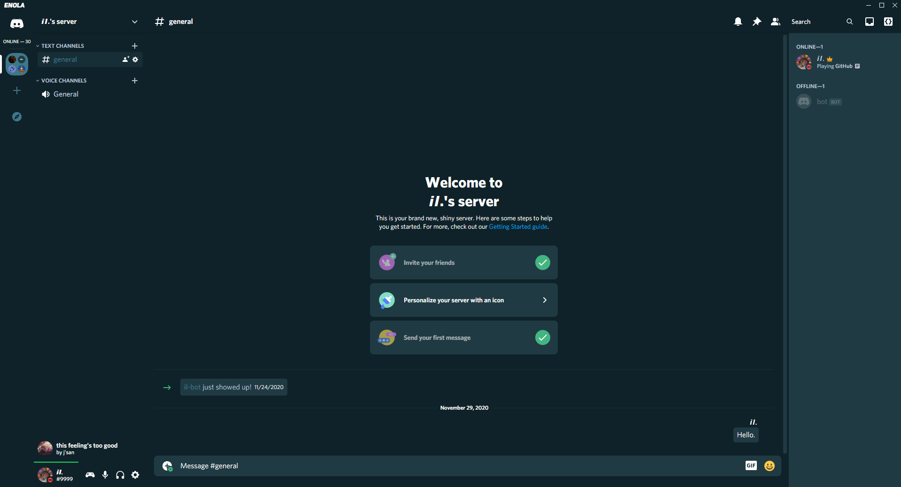
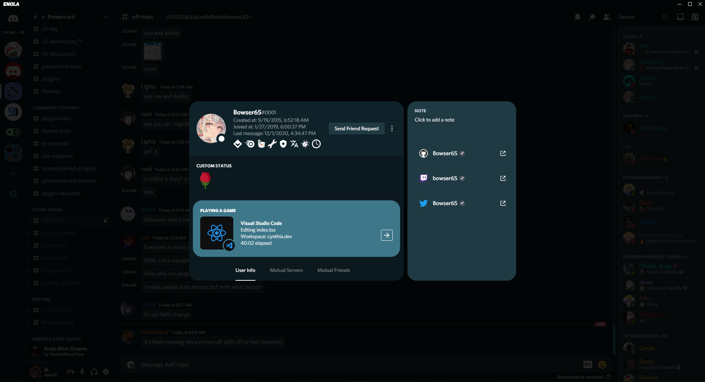

# Enola
A theme for powercord and betterdiscord.

# How to use
Simply just clone the repo in your themes folder, /powercord/src/Powercord/themes, after that just apply it.

```
git clone https://github.com/JustinCWeiler/Enola.git
```

# Issues/Suggestions
If there are any issues or suggestions please message me on discord, PotatoeMaster#0605, or make an issue on github.

# Images


